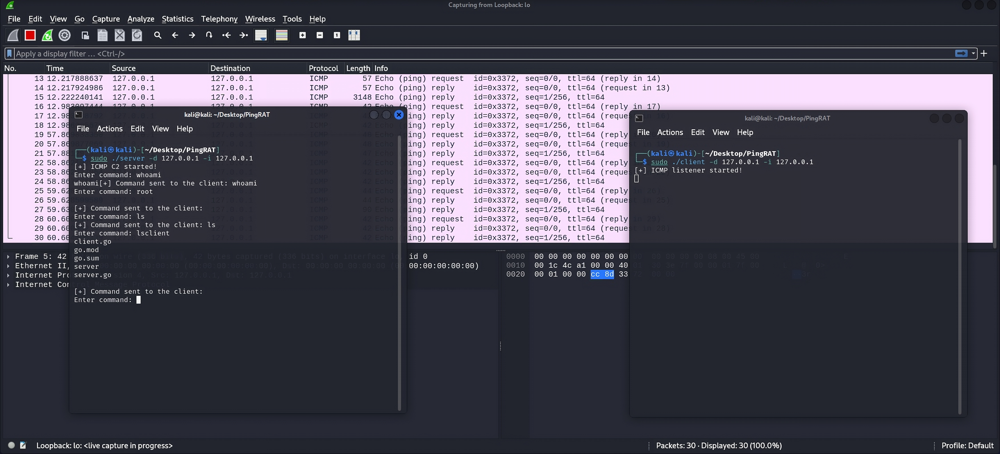

# PingRAT
## PingRAT secretly passes C2 traffic through firewalls using ICMP payloads.

## Features:

- Uses ICMP for Command and Control
- Undetectable by most AV/EDR solutions
- Written in Go

## Installation:
[Download](https://github.com/Nemesis0U/PingRAT/releases) the binaries

or build the binaries and you are ready to go:

    $ git clone https://github.com/Nemesis0U/PingRAT.git
    $ go build client.go
    $ go build server.go

## Usage:

### Server:
```
./server -h
Usage of ./server:
  -d string
    	Destination IP address
  -i string
    	Listener (virtual) Network Interface (e.g. eth0)

```

### Client:
```
./client -h
Usage of ./client:
  -d string
    	Destination IP address
  -i string
    	(Virtual) Network Interface (e.g., eth0)
```

## Screenshot:


